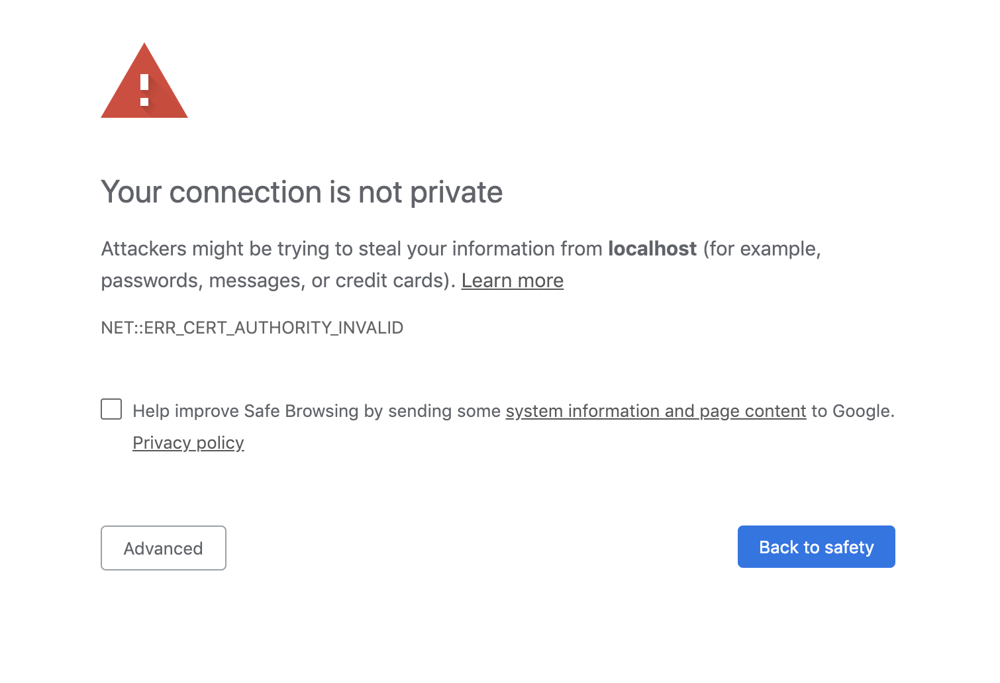

# keytool生成自签名证书springboot配置SSL

#### keytool是jdk自带的生成证书工具，cmd或shell里输入keytool -help即可查看相关操作（需先配置好java环境）

```
keytool -genkey -alias tomcat -storetype jks -keyalg RSA -keysize 2048 -keystore keystore.jks -validity 3650

Enter keystore password:  
Re-enter new password: 
What is your first and last name?
  [Unknown]:  
What is the name of your organizational unit?
  [Unknown]:  
What is the name of your organization?
  [Unknown]:  
What is the name of your City or Locality?
  [Unknown]:  Guangzhou What is the name of your State or Province?
  [Unknown]:  GD
What is the two-letter country code for this unit?
  [Unknown]:  CN
Is CN=Unknown, OU=Unknown, O=Unknown, L=Guangzhou, ST=GD, C=CN correct?
  [no]:  yes

Enter key password for <tomcat>
	(RETURN if same as keystore password):  
```

参数说明：
```
keytool -genkey -help

keytool -genkeypair [OPTION]...

Generates a key pair

Options:

 -alias <alias>                  alias name of the entry to process
 -keyalg <keyalg>                key algorithm name
 -keysize <keysize>              key bit size
 -sigalg <sigalg>                signature algorithm name
 -destalias <destalias>          destination alias
 -dname <dname>                  distinguished name
 -startdate <startdate>          certificate validity start date/time
 -ext <value>                    X.509 extension
 -validity <valDays>             validity number of days
 -keypass <arg>                  key password
 -keystore <keystore>            keystore name
 -storepass <arg>                keystore password
 -storetype <storetype>          keystore type
 -providername <providername>    provider name
 -providerclass <providerclass>  provider class name
 -providerarg <arg>              provider argument
 -providerpath <pathlist>        provider classpath
 -v                              verbose output
 -protected                      password through protected mechanism

Use "keytool -help" for all available commands
```

#### springboot配置application.yml[Configure SSL](https://docs.spring.io/spring-boot/docs/2.0.7.RELEASE/reference/htmlsingle/#howto-configure-ssl)

```
server:
  port: 8443
  ssl:
    key-store: classpath:keystore.jks
    key-store-password: password
    key-password: password

#其他配置
```
keysote.jks文件拷贝到sprinboot项目resource文件下，启动提示
``` Tomcat started on port(s): 8443 (https) with context path '' ```

- 使用自签名的文件访问网站会有安全提示，选择高级继续访问即可
"无效证书提示"

#### 支持http和https两种方式访问[示例](https://github.com/spring-projects/spring-boot/tree/v2.0.7.RELEASE/spring-boot-samples/spring-boot-sample-tomcat-multi-connectors)

1. application.yml添加配置http端口
```
server:
  port: 8443
  ssl:
    key-store: classpath:keystore.jks
    key-store-password: gpsnorth
    key-password: gpsnorth
  http:
    port: 8080
```
2. 添加httpconnector
```
@Configuration
public class HttpServletConnectorConfig {

    @Value("${server.http.port}")
    private int HTTPPORT = 8080;

    @Bean
    public ServletWebServerFactory servletContainer() {
        TomcatServletWebServerFactory tomcat = new TomcatServletWebServerFactory();
        tomcat.addAdditionalTomcatConnectors(createStandardConnector());
        return tomcat;
    }

    private Connector createStandardConnector() {
        Connector connector = new Connector(TomcatServletWebServerFactory.DEFAULT_PROTOCOL);
        connector.setPort(HTTPPORT);
        return connector;
    }

}
```
启动后提示``Tomcat started on port(s): 8443 (https) 8080 (http) with context path ''``

#### http请求重定向到https请求springboot2 (springboot1[参考](https://www.jianshu.com/p/01c4f7a7b2c5))

```
@Configuration
public class HttpServletConnectorConfig {

    @Value("${server.http.port}")
    private int HTTPPORT = 8080;

    @Value("${server.port}")
    private int HTTPSPORT = 8443;

    @Bean
    public ServletWebServerFactory servletContainer() {
        TomcatServletWebServerFactory tomcat = new TomcatServletWebServerFactory()
        {
            @Override
            protected void postProcessContext(Context context) {
                SecurityConstraint securityConstraint = new SecurityConstraint();
                securityConstraint.setUserConstraint("CONFIDENTIAL");
                SecurityCollection collection = new SecurityCollection();
                collection.addPattern("/*");
                securityConstraint.addCollection(collection);
                context.addConstraint(securityConstraint);
            }
        };
        tomcat.addAdditionalTomcatConnectors(createStandardConnector());
        return tomcat;
    }


    private Connector createStandardConnector() {
        Connector connector = new Connector(TomcatServletWebServerFactory.DEFAULT_PROTOCOL);
        connector.setScheme("http");
        connector.setPort(HTTPPORT);
        connector.setSecure(false);
        connector.setRedirectPort(HTTPSPORT);
        return connector;
    }

}
```

