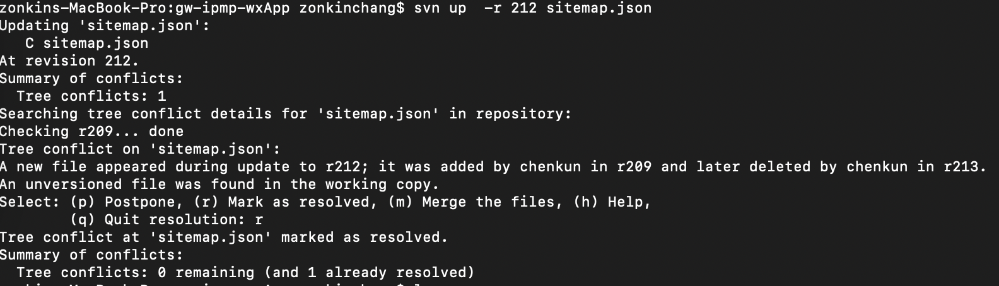
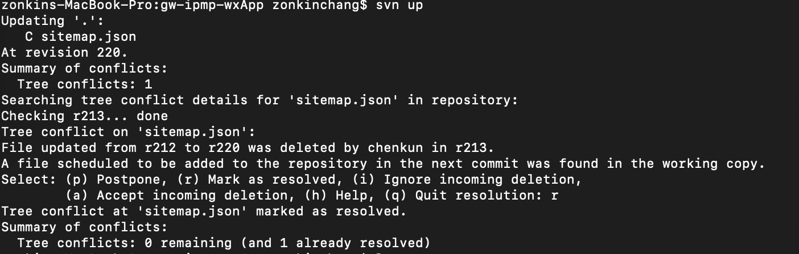

# svn使用

## 历史提交文件日志svn log -l 5 -v xxx.txt 
## 比较文件 svn diff -rold:new xxx.txt
  old:旧版本
  new:新版本，:new可以不填表示与当前工作文件比较
## 查看旧版本文件内容 svn cat -r ver xxx.txt
  ver:文件版本

## 恢复svn仓库已删除的文件
  * svn log -l 5 -v
  查看最近5条提交记录，确认最后文件的版本，取D标识前面一个版本就可以，此处为212版本
  * svn up -r 212 sitemap.json
  更新要从212版本恢复的文件，此处会提示文件在某个版本添加并在某个版本删除，并且这个文件在当前版本里未加入仓库，选择r加入仓库。
  
  * svn status
  查看当前状态，会提示sitemap.json处于删除状态
  * svn up
  更新本地仓库，提示sitemap.json文件冲突，文件已经被删除，是否把文件包含到仓库里，选择包含到仓库。
  
  * svn ci -m "恢复sitemap.json"
  重新提交文件
